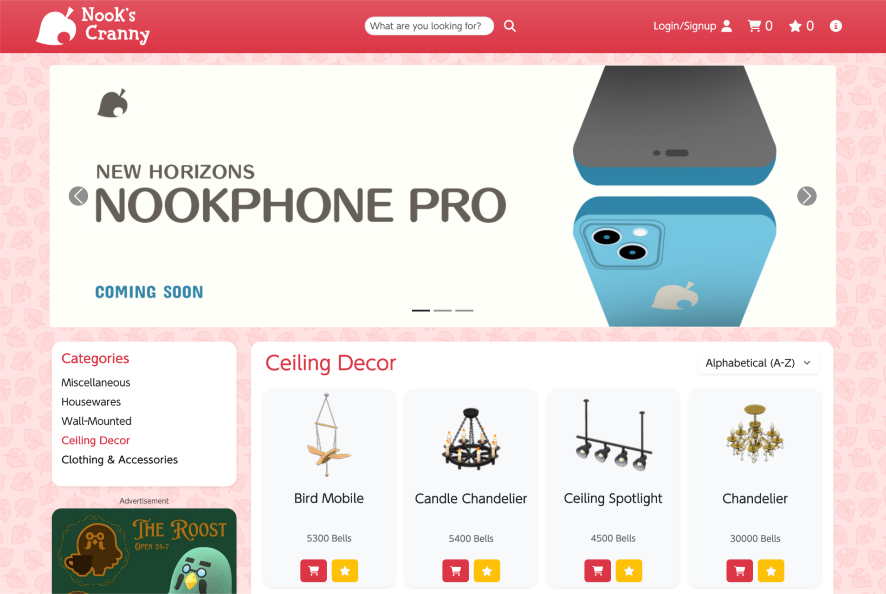

# Nook's Cranny 🛒

Welcome to **Nook's Cranny**, a full-stack web store inspired by Animal Crossing! This project features a fictional online store where you can browse, purchase, and manage your items in a fun, interactive environment.



## Prerequisites

Before you begin, ensure you have the following installed and set up on your local machine:

- **Node.js** (v14 or higher): You can download it from [Node.js Official Website](https://nodejs.org/).
- **npm** (Node Package Manager): This comes bundled with Node.js, but ensure it is up to date by running `npm install -g npm`.
- **Database**: You will need a database management system (e.g., MySQL). Make sure it's installed and running.
- **API Key**: Request an API key from [Nookipedia](https://api.nookipedia.com).

Once you have the prerequisites in place, proceed with the setup instructions below.

## Getting Started

Follow these steps to get the project up and running on your local machine.

### 1. Clone the Repository
- Clone this repository to your local machine using the following command:
```bash
git clone https://github.com/vsilvabruno/NooksCranny.git
cd NooksCranny
```

### 2. Set Up the Backend
- Navigate to the `NooksCranny/Server` folder.
- Copy the contents of the `.env-example` file into a new `.env` file, and fill in your API key.

### 3. Database Setup
- Create a new database in your database management application named `nooks_cranny`.

### 4. Backend Installation
- Open a terminal window and run the following commands:
  ```bash
  cd NooksCranny/server
  npm i                # Install backend dependencies
  npm run setup-tables  # Set up database tables
  npm run import-data   # Fetch 20 random items from Nookipedia API for each category
  npm run dev           # Start the backend in development mode with nodemon
  ```

### 5. Frontend Installation

* Open a **new** terminal window and run the following commands:

  ```bash
  cd NooksCranny/client
  npm i                # Install frontend dependencies
  npm run dev           # Start the frontend in development mode
  ```

### 6. Access the Store

* Once both the backend and frontend are running, open your browser and navigate to the local link shown on your terminal. You're all set to explore the web store!

---

## Features

* **Browse and Shop**: Explore the catalog, add items to your favorites or shopping cart, and proceed with checkout as a guest or registered user.
* **User Authentication**: Log in to save your favorites and shopping cart to the database, and track your order history and status.
* **Admin Panel**: A secure admin panel for managing store items, user accounts, and orders.

#### Admin Panel Access

The Admin Panel is located at the footer of the webpage.
To access it, log in as Tom Nook with the following credentials:

* **Email**: [tomnook@bell.ac](mailto:tomnook@bell.ac)
* **Password**: admin

The Tom Nook account is created automatically during the tables setup.

---

## Credits

* Special thanks to **Nookipedia** for providing access to their API, which powers the item catalog in the store.

---

Enjoy shopping at **Nook's Cranny**!